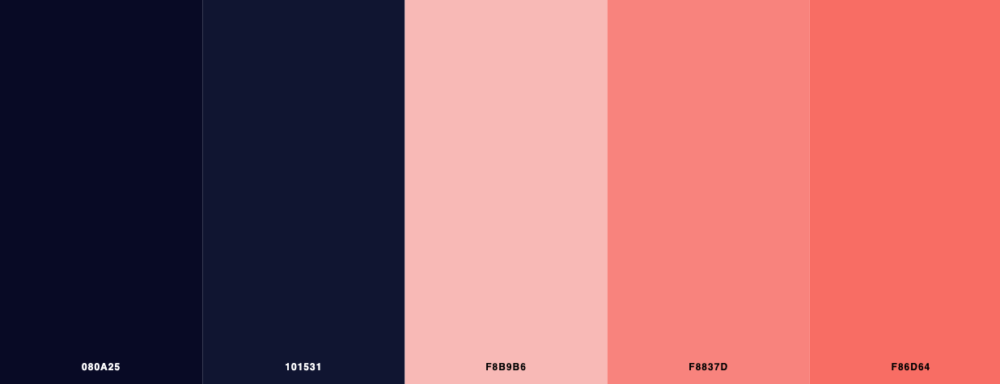
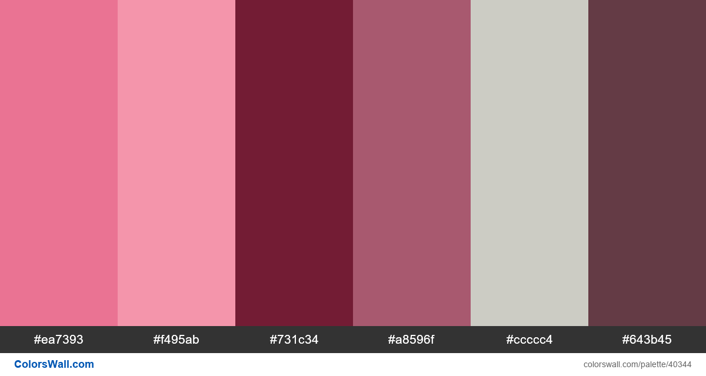

## Inspiration

https://www.color-hex.com/color-palette/7393

https://kdesign.co/blog/feminine-color-palette-ideas/

https://www.schemecolor.com/strong-feminist-color-scheme.php

https://colorswall.com/palette/40344/

https://www.format.com/magazine/features/design/what-is-typography-feminist-font-definition

### Typefaces por mulheres

https://fonts.google.com/specimen/Arbutus+Slab?preview.text_type=custom#standard-styles

https://fonts.google.com/specimen/Palanquin?preview.text_type=custom#standard-styles

https://fonts.google.com/specimen/Palanquin+Dark?preview.text_type=custom

https://fonts.google.com/specimen/Ovo?preview.text_type=custom#standard-styles

https://fonts.google.com/specimen/Sura?preview.text_type=customhttps://fonts.google.com/specimen/Montserrat+Alternates?preview.text_type=custom#standard-styles
